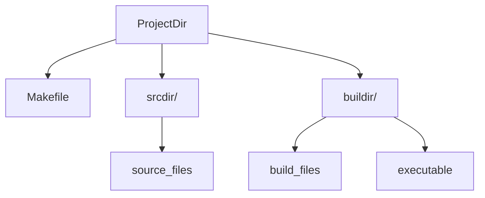

# Introduction

This is the make solution I use to build simple c or c++ projects. It is one of a set of similar sister projects used to build c and c++ projects.
this system can be used to automatically detect the source files generate the depandancy list and compile the source files into a single executable

## How To Use

Using this build solution is simple. All you need to do is copy the [Makefile](Makefile) into your project directory.

```bash
cd /path/to/your/project/
```

then

```bash
curl -sL https://raw.githubusercontent.com/SidhBhat/simple-make-build/main/Makefile > Makefile
```

Now you're going to want to set these variables inside the makefile, to specify where to look for sources and where to build them.

```make
#build configuration
override srcdir     = src/
override buildir    = build/
```

You are preety much set now. however here are compile time variables you can set in the makefile or through the commandline

```make
# Compiler options
CC       = gcc
CLIBS    =
INCLUDES =
CFLAGS   = -g -O -Wall
# Install location
DESTDIR     =
prefix      = /usr/local/
```

## The Directory Structure

The Directory Structure is pretty straightforward. The makefile expects all source files to be directly in `srcdir/`
And all build files are confined to `buildir/`

<!-- Mermaid rendering of flowcharts  -->


## Branches

This repo is organised in two branches one `main` and the other `cpp`. you are currently on `main`
the `main` branch has the c version. To compile c++ projects checkout `cpp`

Prior development included support for c and cpp files in the same project.
But it was decided to drop that version as nobody actually develops independant
projects on the same tree.

## Sibling Projects

This Makefile is one among a set of make solutions to build c and c++ projects
 - [make-build_C_app](https://github.com/SidhBhat/make-build_C_app)
 - [make-build_Cpp_app](https://github.com/SidhBhat/make-build_Cpp_app)
 - [make-build_C_lib](https://github.com/SidhBhat/make-build_C_lib)
 - [make-build_Cpp_lib](https://github.com/SidhBhat/make-build_C_lib)
 - [simple-make-build\*](https://github.com/SidhBhat/simple-make-build)

## Contributing
If you would like to contribute, you can start by simply creating a pull request `:)`.
